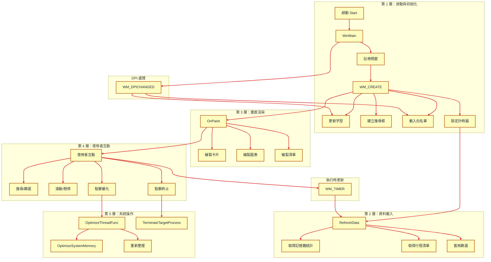

# MemoryMap 專案架構說明

本專案包含一個 Windows 桌面應用程式，透過 Win32 API 建立深色主題的記憶體優化工具介面。

## 檔案概覽

- `main.c`：主要 UI 與應用程式流程。
- `optimizer.c`：系統記憶體與行程查詢、評估與最佳化邏輯。
- `optimizer.h`：共享資料結構與函式宣告。
- `resource.rc`、`ramr.ico`：資源檔案。
- `build.bat`：編譯腳本。
- `Makefile`：使用 make 的編譯規則。

## main.c 設計介紹

`main.c` 的設計目標是把 UI 表現層與資料邏輯分離：它負責視窗建立、佈局計算、繪製、使用者互動與應用程式流程控制，而不直接實作系統記憶體或行程分析。

### 1. 全域狀態管理

- 使用全域變數儲存應用程式狀態。
- `g_Dpi`、`g_Font*`：支援 DPI-aware 顯示。
- `g_Stats`、`g_AllProcesses`、`g_FilteredProcesses`：快取系統記憶體統計與行程清單。
- `g_SearchQuery`、`g_Filter`、`g_ScrollOffset`：實現搜尋、篩選與列表滾動。
- 按鈕與滑鼠互動狀態：`g_HoveredTab`、`g_HoveredRow`、`g_HoveredBtn`、`g_OptimizeBtnHover` 等。

### 2. DPI 與佈局設計

- `Scale()`：統一所有 UI 尺寸的 DPI 縮放，避免硬編碼像素值。
- `UpdateFonts()`：根據目前 DPI 建立四種 `Segoe UI` 字型，確保文字在不同解析度下清晰。
- `UpdateLayout()`：在 `WM_SIZE`、`WM_CREATE`、`WM_DPICHANGED` 等事件中，根據視窗大小計算左側儀表區、右側控制區、列表區域、按鈕位置與搜尋框位置。
- 設計採用彈性佈局：當寬度不足時可重新排列搜尋欄與 Tab，維持畫面可讀性。

### 3. 資料取得與篩選流程

- `RefreshData()`：重新讀取記憶體統計與行程清單，並更新畫面。
- `ApplyFilterAndSearch()`：根據目前 `g_Filter` 與 `g_SearchQuery`，對 `g_AllProcesses` 進行篩選並填入 `g_FilteredProcesses`。
- 設計上，資料來源由 `optimizer.c` 提供，`main.c` 僅負責呈現與篩選。

### 4. 自訂繪製設計

- `DrawRoundedRect()`：封裝 GDI 圓角矩形繪製，統一按鈕、卡片、滑桿與清單列樣式。
- `DrawTextHelper()`：封裝文字繪製與對齊。
- `OnPaint()`：核心繪圖函式，採雙緩衝繪製避免閃爍。
  - 繪製深色主題背景與標題。
  - 繪製三張資訊卡片：實體記憶體、分頁檔、碎片化分數。
  - 繪製三張折線趨勢圖：記憶體負載、分頁檔用量、碎片化趨勢。
  - 繪製一鍵優化按鈕、重新整理按鈕、狀態欄。
  - 繪製篩選 Tab、搜尋欄與行程清單。
  - 支援列表內每列行程的安全等級、記憶體、運行時間與「結束」按鈕。

### 5. 使用者互動與事件處理

- `WndProc()`：主事件處理器。
  - `WM_CREATE`：初始化字型、建立搜尋編輯框、載入白名單、設定計時器、取得初始資料。
  - `WM_DPICHANGED`：更新 DPI、重新計算字型與佈局。
  - `WM_CTLCOLOREDIT`：自訂搜尋輸入框顏色，符合深色主題。
  - `WM_COMMAND`：處理搜尋框文字變更與自訂刷新訊息。
  - `WM_TIMER`：定時更新記憶體狀態、行程更新與狀態訊息清除。
  - `WM_SIZE`：視窗大小改變時重新計算佈局。
  - `WM_MOUSEMOVE` / `WM_MOUSELEAVE`：追蹤滑鼠懸停狀態、Tab、按鈕與列表項目。
  - `WM_LBUTTONDOWN` / `WM_LBUTTONUP`：按鈕點擊、一鍵優化啟動、Tab 選擇、行程結束、捲軸拖曳。
  - `WM_MOUSEWHEEL`：支援列表滾輪滾動。
  - `WM_PAINT`：觸發 `OnPaint()`。
  - `WM_DESTROY`：清理資源與結束程序。

### 6. 一鍵優化流程

- `OptimizeThreadFunc()`：在背景執行優化流程，避免 UI 卡頓。
- 取得優化前後的可用記憶體值，計算釋放量並更新狀態訊息。
- 使用 `PostMessage()` 觸發自訂刷新。

### 7. 程式入口與視窗設定

- `WinMain()`：註冊視窗類別、建立主視窗、設定深色系標題列、啟動主訊息迴圈。
- 設計上採用 `DwmSetWindowAttribute()` 來嘗試啟用 Windows 深色標題列。
- 視窗使用固定大小與居中顯示，並自訂背景避免白閃爍。

## optimizer.c 設計介紹

`optimizer.c` 的設計重點是提供一組系統層級服務：記憶體統計、行程蒐集、安全評估、最佳化操作與白名單管理。這讓 `main.c` 可以專注於 UI 呈現。

### 1. 共用資料模型

- `ProcessInfo`：行程資料結構，包含 PID、名稱、路徑、記憶體使用、運行時長、安全等級與說明。
- `MemoryStats`：系統記憶體統計，包含實體與分頁檔總量、可用量、記憶體使用率與碎片化分數。
- 設計上透過 `optimizer.h` 提供這些結構給 `main.c` 使用。

### 2. 核心函式指標與關鍵行程判斷

- 動態載入 `IsProcessCritical` API，支援不同 Windows 版本。
- `CheckIfProcessIsCritical()`：檢查行程是否為核心關鍵行程，若是則標記為不可終止。
- 設計上避免直接依賴版本特定 API，以增強相容性。

### 3. 記憶體統計評估

- `GetSystemMemoryStats()`：使用 `GlobalMemoryStatusEx()` 取得實體與分頁檔資訊。
- 進一步使用 `GetPerformanceInfo()` 計算 `fragmentationScore`。
- `fragmentationScore` 不是精確碎片率，而是根據快取、核心分頁與行程數建立的估算指標。

### 4. 行程安全評估

- `EvaluateProcessSafety()`：依序判斷是否核心、已知系統行程、Session ID、是否在 Windows 目錄、以及白名單。
- 將行程安全分為：`SAFETY_SAFE`、`SAFETY_CAUTION`、`SAFETY_CRITICAL`、`SAFETY_PROTECTED`。
- 設計上提供明確的文字說明，讓 UI 顯示時可以提示使用者。

### 5. 行程蒐集與資訊擷取

- `GetProcessList()`：使用 `CreateToolhelp32Snapshot()` 掃描所有行程。
- 為每個行程嘗試打開進程，以讀取完整路徑、記憶體使用、Session ID、啟動時間與是否核心。
- 針對無法打開的系統行程或特殊 PID，使用預設值並仍回傳安全類別。
- 設計上將資料讀取封裝成可重用清單函式。

### 6. 記憶體最佳化實作

- `OptimizeSystemMemory()`：遍歷行程並呼叫 `EmptyWorkingSet()`，嘗試釋放每個行程的工作集頁面。
- 之後呼叫 `SetSystemFileCacheSize()` 讓系統縮減檔案快取。
- 設計上將「最佳化」定義為回收可用物理記憶體及減少頁面緩存佔用。

### 7. 行程終止功能

- `TerminateTargetProcess()`：使用 `PROCESS_TERMINATE` 權限終止指定 PID。
- 設計上只提供最小封裝，將權限與錯誤處理留給呼叫端。

### 8. 白名單管理

- `IsWhitelisted()`：查詢行程是否已列入白名單。
- `LoadWhitelist()` / `SaveWhitelist()`：讀寫 `whitelist.txt`，支援簡單文字列表。
- `AddRemoveWhitelist()`：新增或移除白名單條目。
- 設計上將白名單存取與流程整合，使 UI 能在 `EvaluateProcessSafety()` 中保護行程。

## 主要模組關係

- `main.c` 依賴 `optimizer.h` 宣告的 `MemoryStats`、`ProcessInfo`、`GetSystemMemoryStats()`、`GetProcessList()`、`OptimizeSystemMemory()`、`TerminateTargetProcess()`、白名單管理函式。
- `optimizer.c` 實作系統監測、行程評估、最佳化、白名單功能，並由 `main.c` 作為 UI 層呼叫。

## 使用流程摘要

1. 啟動程式並建立主視窗。
2. `main.c` 初始化字型、佈局，載入白名單、讀取系統統計與行程清單。
3. 使用者可透過搜尋框、分頁篩選行程，或點擊「一鍵加速」進行背景記憶體優化。
4. 程式定時更新記憶體統計與行程清單，並以深色主題 UI 顯示狀態。
5. 若使用者嘗試結束行程，程式會依安全等級顯示警告或禁止操作，並透過 `TerminateProcess()` 進行終止。

## 執行流程圖

以下 Mermaid 流程圖採用「階段分區 + 層次化」視覺風格：




## Makefile 編譯指引

專案已新增 `Makefile`，可在已安裝 `make` 的 Windows 環境中使用。

執行以下命令進行編譯：

```bat
make
```

清理解產物：

```bat
make clean
```

如果沒有 `make`，請改用：

```bat
build.bat
```

---

若要編譯，請使用 `build.bat` 或 `make`。